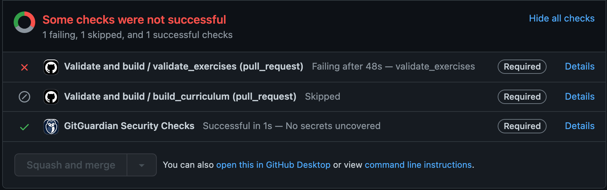
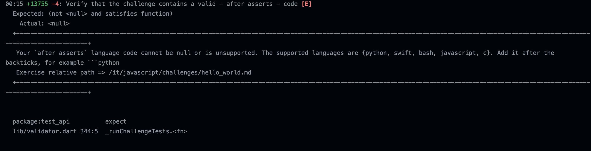
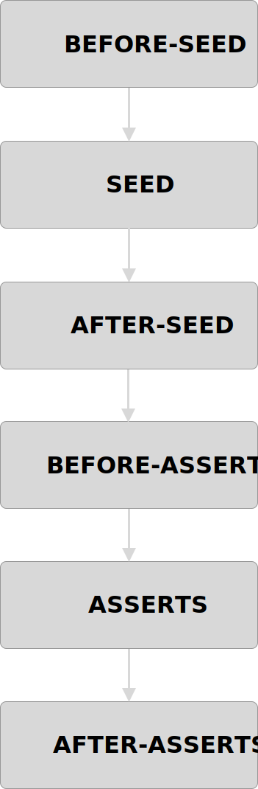

# Welcome

#### _Read this in other languages:

<kbd>[ Italiano](translations/it/CONTRIBUTING.md)</kbd>

Thank you for investing your time in contributing to our project!
Any contribution you make will be reflected on the [Codigo App](https://codigo.bestofcode.dev)

## New contributor guide

Here are some resources to help you get started with open source contributions:

- [Finding ways to contribute to open source on GitHub](https://docs.github.com/en/get-started/exploring-projects-on-github/finding-ways-to-contribute-to-open-source-on-github)
- [Set up Git](https://docs.github.com/en/get-started/quickstart/set-up-git)
- [GitHub flow](https://docs.github.com/en/get-started/quickstart/github-flow)
- [Collaborating with pull requests](https://docs.github.com/en/github/collaborating-with-pull-requests)

## Getting started

You can contribute in many ways to the codigo questions:
- adding new ones
- creating an issue for a bug/typo
- fixing bugs and typos

## Create an issue

When you create an issue please provide as much detail as you can about the problem you are experiencing.
If you can provide also a screenshot of the app showing the problem.

> If you experience a problem in a specific exercise inside the app, click the report icon on the top right, in this way you're automatically redirected to GitHub and the title with the exercise path is already provided for you.

## Creating a PR

When you create a PR, you should fill the template.
It asks you to provide the details of the changes with a description, a link to an issue and the type of change:
- [ ] ✨ New feature (non-breaking change which adds functionality)
- [ ] 🛠️ Bug fix (non-breaking change which fixes an issue)
- [ ] ❌ Breaking change (fix or feature that would cause existing functionality to change)
- [ ] 🧹 Code refactor
- [ ] 📝 Documentation
- [ ] 🗑️ Chore 

To be able to review your PR there are some requirements:
1. All the GitHub checks must pass
2. Assign yourself to the PR, and anyone that helped you.
3. Add the properly label (bug, chore, question, feature)
4. Mark your PR as ready	
5. Add @nank1ro as reviewer

__I will review your PR only after all of these steps have been completed__

>  1. More info about the github checks

These are the GitHub checks, each one must be green.
If the `validate_exercises` check fails, click on the right button __Details__

Scroll down until you find errors, like in this picture:

Read the error and fix it following the instructions provided.

The _exercise relative path_ tells you in which exercise the error happened.

## Exercise Composition

To compose an exercise to make it working on the app, we use the following order:

Not all of these sections are required, this vary based on the exercise type.

## Add new questions

To add new question we suggest to start using our predefined templates, that you can find in the
/translations/{langCode}/templates

Currenly Codigo supports four types of exercises:
- run code (code: 1)
- fill empty spaces (code: 2)
- choose answer (code: 3)
- sort code (code: 4)

In the templates you can find the programming language, followed by the language code, e.g:

c_2 => A _fill empty spaces_ exercise in the C programming language

You can copy a template, and replace all the text with your new exercise, so you don't have to write the exercise structure from scratch each time.

If you're writing a __run code__ exercise (code: 1), you can also you the CLI.
For more info read the [CLI Readme.md](./cli/README.md)

## Q&A

  
Can I add a new programming language?

	Yes you can add a new programming language, but this requires a lot of work because involves also a new app release.
	In addition, not all programming language are supported by our backend.
	For now I'm planning to add `Kotlin` and `Go`.
	
All the programming languages that our backend supports are:

- Assembly (NASM 2.14.02)
- Bash (5.0.0)
- Basic (FBC 1.07.1)
- C (Clang 7.0.1)
- C++ (Clang 7.0.1)
- C (GCC 7.4.0)
- C++ (GCC 7.4.0)
- C (GCC 8.3.0)
- C++ (GCC 8.3.0)
- C (GCC 9.2.0)
- C++ (GCC 9.2.0)
- Clojure (1.10.1)
- C# (Mono 6.6.0.161)
- COBOL (GnuCOBOL 2.2)
- Common Lisp (SBCL 2.0.0)
- D (DMD 2.089.1)
- Elixir (1.9.4)
- Erlang (OTP 22.2)
- Executable
- F# (.NET Core SDK 3.1.202)
- Fortran (GFortran 9.2.0)
- Go (1.13.5)
- Groovy (3.0.3)
- Haskell (GHC 8.8.1)
- Java (OpenJDK 13.0.1)
- JavaScript (Node.js 12.14.0)
- Kotlin (1.3.70)
- Lua (5.3.5)
- Multi-file program
- Objective-C (Clang 7.0.1)
- OCaml (4.09.0)
- Octave (5.1.0)
- Pascal (FPC 3.0.4)
- Perl (5.28.1)
- PHP (7.4.1)
- Plain Text
- Prolog (GNU Prolog 1.4.5)
- Python (2.7.17)
- Python (3.8.1)
- R (4.0.0)
- Ruby (2.7.0)
- Rust (1.40.0)
- Scala (2.13.2)
- SQL (SQLite 3.27.2)
- Swift (5.2.3)
- TypeScript (3.7.4)
- Visual Basic Net (vbnc 0.0.0.5943)

  
I don't find info about something

	Open an issue, and if this can be helpful for others, I'm going to add it to the CONTRIBUTING file or to the README 
	

